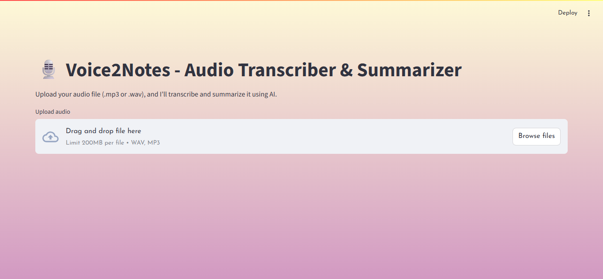
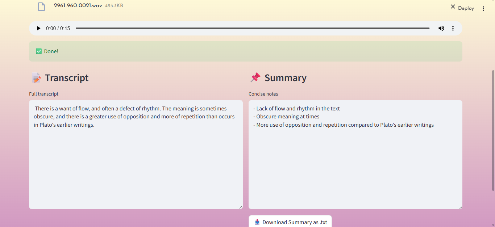

# 🎙️ Voice2Notes — Audio Transcriber & Summarizer App

**Voice2Notes** is an AI-powered web application that allows users to upload `.wav` or `.mp3` audio files and receive a clean, concise summary of the spoken content. Powered by **Whisper** (for transcription) and **Azure OpenAI GPT-3.5** (for summarization), it’s ideal for summarizing voice notes, interviews, lectures, and meetings — all in a beautiful, user-friendly interface.

---

## 🚀 Features

- 🔊 Upload `.wav` or `.mp3` audio files
- ✍️ Transcription via OpenAI Whisper
- 🧠 Summarization via Azure OpenAI (GPT-3.5)
- 🪄 Clean and modern interface with light theme
- 🎨 Gradient background and elegant **Josefin Sans** font
- 📥 Download summary as `.txt` file
- 🔐 Secrets handled securely via `.env` or Streamlit Secrets

---

## 🌐 Live Demo

Check out the deployed app 👉  
🌐 [Voice2Notes – Streamlit](https://voice2notesapp-parthmendiratta.streamlit.app/)

---

### 📸 Screenshots

#### 🎧 Upload Audio


#### 📝 Transcript + Summary View



---

## 🗂️ Project Structure

```
voice2notes/
│
├── app.py                # 🌐 Streamlit frontend
├── transcribe.py         # 🎧 Whisper-based audio transcription
├── summarize.py          # 🧠 GPT summarization (Azure OpenAI)
├── requirements.txt      # 📦 Project dependencies
├── .env                  # 🔐 API secrets for local use
├── .gitignore            # 🚫 Ignore env, audio files, etc.
└── README.md             # 📘 This file
```

---

## 🔧 How to Run Locally

1. Clone the repository:
   ```bash
   git clone https://github.com/parthmendiratta/voice2notes.git
   cd voice2notes
   ```

2. Install dependencies:
   ```bash
   pip install -r requirements.txt
   ```

3. Add your `.env` file with these variables:
   ```
   AZURE_OPENAI_KEY=your-key
   AZURE_OPENAI_ENDPOINT=https://your-resource.openai.azure.com/
   AZURE_OPENAI_DEPLOYMENT=gpt-35-turbo
   AZURE_OPENAI_API_VERSION=2023-07-01-preview
   AZURE_OPENAI_MODEL_NAME=gpt-35-turbo
   ```

4. Run the app:
   ```bash
   streamlit run app.py
   ```

---

## 🧠 Under the Hood

- 🎧 **Whisper**: Converts audio to text locally — fast and reliable
- ✍️ **Azure GPT-3.5**: Summarizes the transcribed content using your Azure OpenAI deployment
- 📁 Files are processed in memory; nothing is permanently stored

---

## 🛡️ Notes on Security

- `.env` is ignored in `.gitignore` — secrets never pushed to GitHub
- On Streamlit Cloud, secrets are managed via `secrets.toml` securely

---

## 💡 Potential Use Cases

- 🗣️ Meeting recaps
- 🎓 Lecture summarization
- 🎤 Podcast note-taking
- 📱 Voice memo understanding
- 🎬 (Upcoming!) YouTube video summaries

---

## 👨‍💻 Author

Developed with ❤️ by **[Parth Mendiratta](https://www.linkedin.com/in/parth-mendiratta-66aa48305)**  
GitHub: [@parthmendiratta](https://github.com/parthmendiratta)

---
